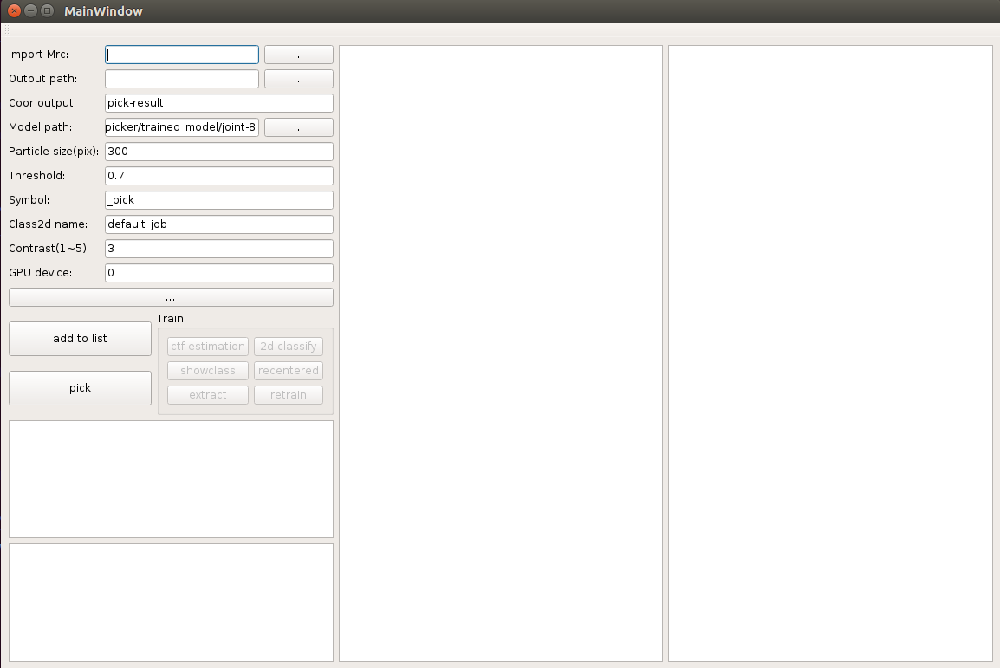

# README #

This README would normally document whatever steps are necessary to get your application up and running.

## How to use DeepPicker? ##
```
bash install.sh #install environment
cd ui
./picker #open deeppicker ui
```



## User's input ##
* Import Mrc: path-of-your-mrcphoto/\*.mrc
* Output path: path-of-deeppicker-output (e.g. OUTPUT)
* Particle size: pixel size of the particle
* Threshold: a float value between 0 and 1. The higher is this value, the more accurate will be the pick results.
* Contrast: a integer between 1 and 5, just only used for mrc-photo visualization.
* GPU device: (e.g., use one gpu: 0; use multiple gpus: 0,1,2,...)

## Procedure ##
* Click `add to list` to import all \*mrc photo.
* Select mrc photo and click `pick`.
* If you are not satisfied with the picked results, please do as follows.
* After picking, click `ctf-estimation`.
* When ctf-estimation finish, click `2d-classify`, and then click `showclass` to check classification results.
* Double-click the class image to select, and right-click to mark positive/negative classes, and click `extract` to extract particles as pkl format.
* After clicking `extract`, click `retrain` to refine the model.
* Then you can use the retrained model to pick the particles again.